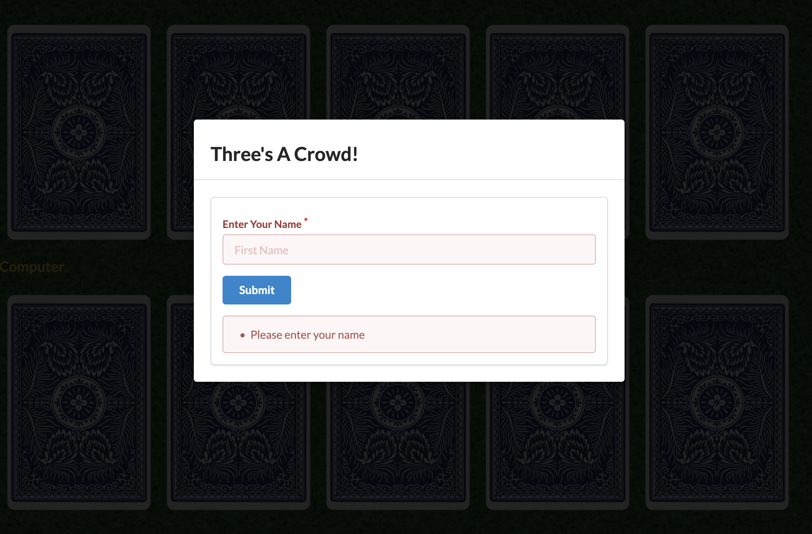
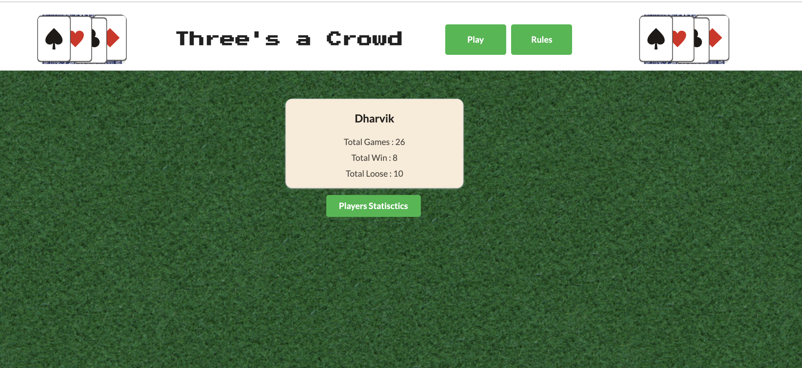

# Three's A Crowd

We've created a game in where the player is to acquire three cards of either matching suit. The player can choose to view the rules in a modal pop up if they click on the "Rules" button in the header. When the "Play" button is clicked, the player is asked for their name which sets up score and name being stored in local storage.

# Tools

In order to create our MVP, we've put our knowledge of HTML, CSS, and Jquery to great us. We've chosen Semantic UI as our CSS framework and after extensive research have implemented it throughout.

It is uploaded in GitHub. 

For clone the project use below options or  you can download Zip file.

SSH "git@github.com:bhumisha/ThreesCrowd.git"
HTTPS : https://github.com/bhumisha/ThreesCrowd.git

Project Source code : https://github.com/bhumisha/ThreesCrowd

You can play the game using below link
https://bhumisha.github.io/ThreesCrowd/

# Screenshots

Pre-game state:

"Play" clicked state / Error handling:

"Rules" clicked state:

Game drawn state:

Game Win state:

Game Lost state:

Game Stalemate state :

Game Result for Player state :

All Players Game Details :

